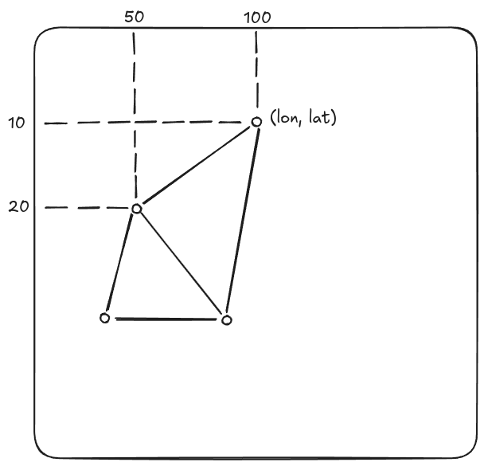
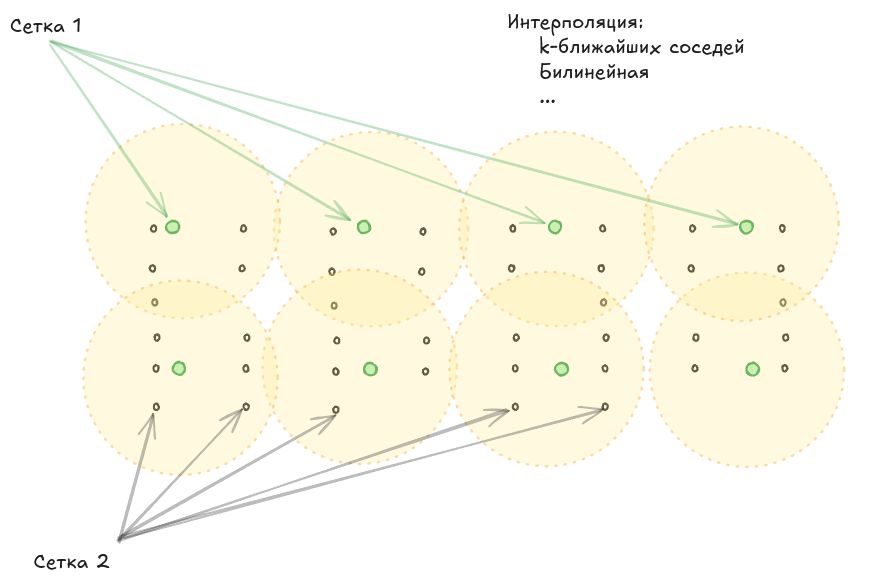

# Nss Lab learn

- начал с курса: https://www.youtube.com/watch?v=699jkjLJGyM&list=PLpykv05eUR0rAuaLnybkZORnCwyND4CV4
- документация: https://unidata.github.io/netcdf4-python/
- курс по QGIS: https://urokiqgis.ru/geodata
- Основные понятия в ГИС: https://www.youtube.com/watch?v=6gOP3oaunIg
- GeoPandas: https://geopandas.org/en/stable/docs/user_guide/data_structures.html

___
## netCDF 
**Стуктура** netCDF в xarray:

- **Dimensions** - размерность данных, может хранить значения высоты, глубины, давления. Задает "пространство", в котором существуют данные. 
- **Coordinates** - определяет положение в пространстве.
- **Data variables** - массивы, содержащие основные научные данные. Их форма определяется набором измерений.
- **Indexes** - Структуры данных, созданные xarray для эффективного доступа к данным по значениям координат (а не только по целочисленным позициям). Это "движок" для операций типа .sel(), .interp(), .groupby() по координатам.
- **Attributes** - Пары "ключ-значение" (оба обычно строки), содержащие метаданные о измерениях, координатах, переменных данных или о всем наборе данных.

- **data_vars** должен по кол-ву элементов обязательно соответсвовать **coords**
- для каждой **coords** и **data vars** должен существовать **attrs**

#### CF Standard Names List
https://cfconventions.org/Data/cf-standard-names/current/build/cf-standard-name-table.html

#### Attribute Convention for Data Discovery 
https://wiki.esipfed.org/Attribute_Convention_for_Data_Discovery_1-3

#### Metadata
- метаданные, которые описывают файл в целом (обычно лежат в атрибутах)
- **Global attributes**
```xrds.attrs['title'] = 'My netCDF4 file 🧐🤔'```

- **Variable attributes**
```xrds['time'].attrs['units'] ='seconds 2025-05-28T21:00:00Z'```


### Plot netCDF with cartopy
**plot netcCDF**: https://www.youtube.com/watch?v=r5m_aU5V6oY&t=1s

**cartopy**: https://www.youtube.com/watch?v=4M2aiHvhr5Y

**крутая статья))**: https://newtechaudit.ru/vizualiziruj-audiruj-cartopy/


По типу проецирования Map projections можно разделить на:
- азимутальные
- конические
- цилиндрические
- псевдо-проекции

Главные проекции в cartopy:
- *Plate-Carree* (для ценителей плоской Земли) 
- *Orthographic* (для «шарящих»)
___
### **Geotiff**
формат, определяет:  
1. проекцию (название)
2. координаты угла
3. кол-во столбцов и сток

___

### Геопривязка (GCP - georefernced control points):
Необходимо минимум 3 точки для привязки, на все остальные точки действует интерполяция (самая простая это k-ближайших соседей).

<p align="center">
  
</p>

Показывает как одни точки растрового изоброжения накладываются на другие.

<p align="center">
  
</p>